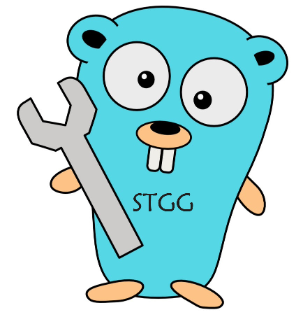

# STGG (Simple template generator on Golang)



Данный проект представляет собой CLI-утилитку для генерации шаблонных файлов.

Утилита позволяет вам удобно генерировать шаблоны с
помощью [стандартного языка шаблонов GOLANG](https://learn.hashicorp.com/tutorials/nomad/go-template-syntax)

## Установка

В релизах присутствуют необходимые бинарные файлы для Windows, OSX и Linux

Если необходима доработка генератора под свои нужды, то можно отправить PullRequest или форкнуть проект себе и внести
необходимые изменения

## Краткая инструкция по использованию

### Сохранение шаблона

Для создания первого шаблона необходимо сохранить его с помощью команды

```bash
stgg saveTemplate TEMPLATE_NAME TEMPLATE_PATH
```

Где

1. __TEMPLATE_NAME__ является кратким литералом для нашего шаблона, по которому мы будем обращаться к нему. Можно задать
   любое имя, по которому удобнее будет обращаться
2. __TEMPLATE_PATH__ является путем до директории с нашими файлами для шаблона После этого все файлы в текущей
   директории станут доступны для генерации

**Примечание все файлы по умолчанию будут сохранены в директорию templates в домашнем каталоге. Для переопределения
местоположения директорий, а так же других путей следует переопределить файл конфигурации. Об этом можно узнать в
пункте ___"Конфигурация"___

### Генерация шаблона

Для генерации шаблона стоит использовать команду

```bash
stgg generate TEMPLATE_NAME ...
```

Имеется два способа передать аргументы для генерации

1. __Локальные переменные__ переменные таким способом будут передаться непосредственно в аргументах командной строки.
   После названия шаблона, который хотим сгенерировать, стоит написать через пробел переменные, которые будут
   использоваться в процессе генерации. Т.е нечетному аргументу после имени шаблона будет соответствовать название
   переменной, а четному-значение. __Пример:__

```bash
stgg generate TEMPLATE_NAME my_variable1 my_value1 my_variable2 my_value2
```

2. __Переменные по пути из конфига__ в этом в случае в качестве аргумента мы задаем путь до yaml файла, в котором можем
   указать необходимые переменные и их значения. Для этого нам нужно применить необходимый флаг: ___--path или -p___. __
   Пример:__

```bash
stgg generate TEMPLATE_NAME C:\myDir\my_variables.yaml --path
```

___
Помимо этого, имеется возможность задать глобальные переменные. После первого использования нашей утилитки в домашней
директории будут сгенерированы файлы, среди которых есть globalVariables.yaml. В этом файле можно задать переменные,
которые не меняются с каждой новой генерацией

Переменные, которые мы указали используются для валидной подстановке в шаблон. Таким образом, если мы передали с помощью
команнды генерации переменную my_variable1 то она будет подставляться в сохраненый
шаблон ([см синтаксис шаблонов](https://learn.hashicorp.com/tutorials/nomad/go-template-syntax))

Для примера, при передачи аргумента my_value1 в шаблонах, которые мы ранее сохранили все фрагменты {{.my_value1}} будут
заменены соответствующем значением

### Доступные команды и их краткое описание

1. __stgg allTemplates__ показывает список всех доступных шаблонов для генерации, которые мы ранее скопировали в
   директорию с шаблонами или сохранили с помощью команды __stgg saveTemplate__
2. __stgg editGlobalVariables__ открывает файл для редактирования, который содержит глобальными переменные, которые мы
   используем в процессе генерации
3. __stgg editTemplate TEMPLATE_NAME__ Открывает файл конфигурации. Там содержаться пути до файла с глобальными
   переменными и до директории с шаблонами. (Более подробнее о конфигурации в пункте ___"Конфигурация"___)
4. __stgg generate ..__ команда для генерации шаблонов. Более подробно описание в пункте ___"Генерация шаблона"___
5. __stgg openTemplate TEMPLATE_NAME__ открывает директорию с указанном шаблоном
6. __stgg openTemplatesDir__ открывает директорию, которая хранит список всех наших шаблонов
7. __stgg removeTemplate TEMPLATE_NAME__ удаляет шаблон из нашей директории с ранее сохраненными шаблонами
8. __stgg saveTemplate ..__ сохранения нового шаблона. Более подробно в пункте __Сохранение шаблона__

### Конфигурация

Утилита имеет некоторую гибкость для настройки. Таким образом, при первом использовании утилиты будут сгенерированы
файлы в домашней директории:

1. stggConfig.yaml Файл, который содержит путь по умолчанию для директории, куда шаблоны будут сохранятся и путь до
   файла с глобальными переменными- globalVariables.yaml. Пути можно переопределить на более удобные для вас
2. globalVariables.yaml файл, в котором будут содержаться наши глобальные переменные
3. templates - папка

Пути до файла с глобальными переменными и директории templates можно переопределить см stggConfig.yaml

### Некоторые примечания

* Если мы передали в команде stgg generate переменные, которые
уже есть в globalVariables.yaml, то эти новые переменные переопределят уже существующие
