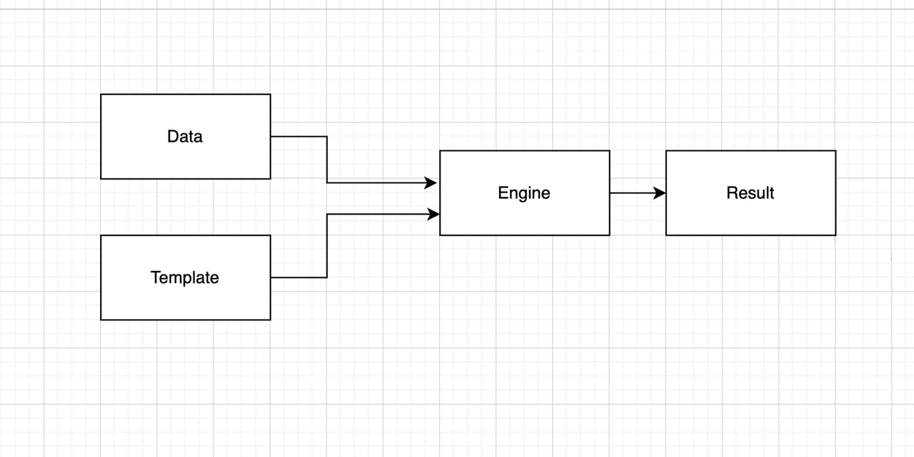

# Шаблонизация и шаблонизаторы в современном мире разработки ПО

//TODO тут может быть красивое вступление(или ваша реклама)

# Разбираемые темы

+ [Шаблонизация](#шаблонизация) 
+ [Сферы использования шаблонизаторов и выбор под конкретную задачу](#где-используются-шаблонизаторы) 
+ [Популярные шаблонизаторы](#популярные-шаблонизаторы)
+ [Языки шаблонов у популярных ЯП](#популярные-шаблонизаторы)
+ [О дипломном проекте](#о-дипломном-проекте)

# Шаблонизация

Шаблоны — слой преобразования (или схема, набор инструкций) данных из одного формата в другой. Иными словами, это функция, которая принимает на вход какие-то данные/инструкции преобразует их и на вход отдает необходимый результат

Шаблонизатор это вид ПО, который использует шаблон описанный с помощью какого-либо декларативного языка разметки для генерации конечного результата

## Составные элементы шаблонизатора

Основополагающими элементами всех шаблонизаторов являются:

+ __Модель с данными__. Содержит необходимые данные в структурированном виде, которые будут применены к шаблону. Формат данных может быть любым и будет ограничен лишь используемым шаблонизатором. Таким образом, для шаблонизатора могут быть допустимы модели с данными в виде json, yaml, xml, электронны таблиц и тд. В каких-то шаблонизаторах мы можем использовать сразу несколько форматов для моделей, другие же ограничены в типах данных, которы могут быть использованы. Однако, стоит отметить, что на вход шаблонизатору можут передаваться неподготовленные данные. В этом случае для корректной работы движка необходимо их не только получить, но и грамотно структурировать
+ __Шаблоны с данными__. Является каркасом для построение итогового документа и описывают то, какая структура должна будет получиться в результате шаблонизации. Язык шаблонизации так же будет зависеть от конкретного вида шаблонизатора. Он может описывать шаблоны с помощью какого-то языка программирования, специального языка шаблонов или же комбинировать данные подходы для большей гибкости
+ __Движок шаблонов__. Некий механизм, который генерирует необходимый нами документ из модели данных и шаблонов. Ему мы будем передавать необходимы данные в определенном формате и шаблон какого-либа вида и на выходе получать результат
+ __Сгенерированные документы/документ__. Является результатом работы движка шаблонизатора, которому были переданы модели с данными и шаблон. см [задачи шаблонизатора](#по-задачам-шаблонизатора)

Упрощенная модель взаимодействия описанных выше составных частей приведена на следующей диаграмме



# Классификация шаблонизаторов 

## __По задачам шаблонизатора__

Основная задача шаблонизатора состоит в отделении данных от структуры шаблона и получение конечного результата, полученного наложением данных на конкретный шаблон

Шаблонизаторы используются для генерации

+ __Текста__. В этом случае шаблоны не привязаны к какому-то выходному формату и генерируют произвольный текст
+ __Исходного кода__. Шаблонизаторы могут генерировать исходный код из абстрактных моделей с данными(UML, реляционны данные, спецификация API для swagger и тд)
+ __HTML__. В этом случае в шаблонах мы описываем структуру и получаем готовый HTML. Является один из самых распространеных вариантов шаблонизации.
+ __DOM__. Генерация DOM дерева, которые генерируют шаблоны для составных частей и поддерживают некую связь между HTML и DOM
+ __Файлов конфигурации__

## __По семантике__ 

### Интерполяция строк

Один из самых простых вариантов шаблонизации. В этом случае мы берем некий шаблон и подставляем в какие-то точки шаблона данные, которые мы отдали шаблонизатору. 

Стандартная реализация данного механизма присуща всем языкам программирования. Как пример - вывод оторфматированной строки в консоль. Для примера приведу код на языке Golang

```Golang
    fmt.Printf("Hello %s", "world")
```

Тут на выходе в консоли мы получим необходимую нам строку "Hello world"

Далее возьмем более сложный пример, используем тот же Golang, но уже подключаем к работе его встроенный язык шаблонов

На входе имеем данные о книгах и их жанрах

```Golang
var data = map[string][]string{
    "Sherlock Holmes": []string{"detective", "adventures"},
    "Little prince": []string{"children", "classic"},
}
```

Необходимо вывести эту информацию в следующем виде:
```
book [genres: list of genres]
..
```

Для начала опишем шаблон с помощью встроенного языка шаблонов golang и выведем результат подстановки в консоль

```Golang
var tmpl = "{{range $book, $genres := .}} {{$book}} [genres:{{range $genres}} {{.}}{{end}}] \n{{end}}"
t, _ := template.New("").Parse(tmpl) 
t.Execute(os.Stdout, data) 
```

В переменной tmpl мы описывали то, как будет выглядеть наш шаблон. При этом использовали циклы для нужного нам вывода данных

Получим следующий результат:
```
Sherlock Holmes [genres: detective, adventures]
Little prince [genres: children, classic]
```

Таким образом, мы получили более сложный шаблон при помощи подстановки строк с использованием стандартного языка шаблонов golang


### Data binding

Более сложный вариант. Основная идея в том, что используется шаблон без специальных символов, присущих языку шаблонов. Структура и семантика исходного текста остается нетронутой. Далее уже с помощью описанных в моделях данных мы преобразуем шаблон и на выходе получаем нужный нам результат

Таким образом, можно использовать в качестве шаблона, например, HTML, XML, BBCode и тд

Для примера, разберем работу шаблонизатора [transparency](https://github.com/leonidas/transparency) для шаблонизации HTML

Имеется исходный XML

```HTML
<div id="template">
  <span class="greeting"></span>
  <span data-bind="name"></span>
</div>
```

Необходимо его преобразовать и вставить нужные данные, для этого нужно выполнить следующий код

```JS
var hello = {
  greeting: 'Hello',
  name:     'world!'
};

$('#template').render(hello);
```

И получим необходимый нам HTML

```HTML
<div id="template">
  <span class="greeting">Hello</span>
  <span data-bind="name">world!</span>
</div>
```

Таким образом, с помощью transparency мы создали необходимый нам HTML файл не затрагивая исходную структуру шаблона

### Live data binding

Является продвинутой версией data binding. Такой подход обеспечивает динамическое изменение данных внутри шаблонов во время работы программы. Таким образом, например, изменения какого-то параметра повлечет за собой и изменение результата шаблонизации

Для примера, рассмотрим библиотеку [knockout.js](https://github.com/knockout/knockout)

Имеется исходный шаблон

```HTML
<p>First name: <input data-bind="value: firstName" /></p>
<p>Last name: <input data-bind="value: lastName" /></p>
<h2>Hello, <span data-bind="text: fullName"> </span>!</h2>
```

Для связывание данных, используется "реактивная модель" которая сможет обеспечить динамиечское изменение исходного шаблона. Чтобы вставить данные в этот шаблон, необходимо связать верстку с логикой, используя следующий код

```JS
var ViewModel = function(first, last) {
    this.firstName = ko.observable(first);
    this.lastName = ko.observable(last);
 
    this.fullName = ko.pureComputed(function() {
        return this.firstName() + " " + this.lastName();
    }, this);
};
 
ko.applyBindings(new ViewModel("Maksim", "Provotorov"));
```

И на выходе получим следующий шаблон

```HTML
<p>First name: Maksim</p>
<p>Last name: Provotorov</p>
<h2>Hello, <span>Maksim Provotorov</span>!</h2>
```

Таким образом, мы связали данные, но помимо этого получили возможность динамического изменения шаблона из кода


### Data driven

Данный тип шаблонизаторов использует принципиально другой подход, в отличии от ранее описанных шаблонизаторах. Внутри шаблонов описано лишь преобразования над входными данными, которые мы отдали шаблонизатору. Таким образом, результат работы будет зависеть от входных данных, которые мы передали и потом только от описаний преобразований внутри шаблонов

Для наглядности, разберем работу XSLT

Пусть имеются входные данные

```XML
<?xml version="1.0"?>
<data>
  <caption>Cap</caption>
  <people>
    <person>John</person>
    <person>Doe</person>
  </people>
</data>
```

Необходимо их преобразовать в следующую строку 

```
Cap: John, Malkovich, Doe
```

Код, который преобразуем исходные данные в текущий шаблон будет выглядеть следующим образом

```XSL
<?xml version="1.0" encoding="UTF-8"?>
<xsl:stylesheet version="1.0" xmlns:xsl="http://www.w3.org/1999/XSL/Transform">
  <xsl:template match="/data/caption">
    <xsl:value-of select="." />:
  </xsl:template>
  <xsl:template match="/data/people/person">
    <xsl:value-of select="." />,
  </xsl:template>
  <xsl:template match="/data/people/person[position() = last()]">
    <xsl:value-of select="." />
  </xsl:template>
</xsl:stylesheet>
```

Итак, данный тип шаблонизаторов, исходный шаблон выступает в роли определенных правил преобразований, который преобразует входные данные. Такой тип шаблонизаторов более сложен в использовании чем ранее разобранные примеры, поэтому перед тем, как работать с ним, нужно быть уверенным, что для цели, которая поставлена, лучшим инструментом будет выступать шаблонизатор с данной семантикой

## По синтаксису

### Тест в финальном виде со вставками

Является наиболее распространенным вариантом шаблонизаторов. Отличается тем, что в шаблоне с помощью специальных символов вставляется и преобразуются данными. Мы можем вставлять данные в необходимые места шаблонов, использовать переменные, циклы, встроенные и кастомные функции. Ранее был разобран специальный язык шаблонов Golang. в разделе ["популярные шаблонизаторы"](#популярные-шаблонизаторы) можно найти больше информации о шаблонизаторах, использующих такой синтаксис

### Сокращенный синтаксис

Имеют свой специальный синтаксис, который сокращает код шаблонов. Имеет такие же возможности, но позволяет писать меньше кода и делать это более лаконично. Такое подходит не для всех задача, ибо для такого синтаксиса шаблон должен иметь четкую структуру, как, например, HTML. 

Рассмотрим пример подобного синтакиса на примере шаблонизатора для HTML - HAML

Для того, чтобы сгенерировать подобную структуру с помощью сокращенного синтаксиса, который предоставляет нам HAML

```HTML
<div id='content'>
  <div class='left column'>
    <h2>Welcome to our site!</h2>
    <p><%= print_information %></p>
  </div>
  <div class="right column">
    <%= render :partial => "sidebar" %>
  </div>
</div>
```

нужно написать следующую структуру

```
#content
  .left.column
    %h2 Welcome to our site!
    %p= print_information
  .right.column
    = render :partial => "sidebar"
```

### Предметно-ориентированный синтаксис

Для полного понимания, следует ввести определение, что такое предметно-ориентированный язык

Предметно-ориентированный язык- это язык, который специализируется на конкретной задаче, имеющий более высокий уровень абстракции. Такие языки более понятные чем языки общего назначения и требования к пользователю, соответственно, ниже

Ранее мы уже [разбирали](#data-driven) подобный тип синтаксиса. Такой тип зависит от данных и в целом от предметной области

## По среде выполнения

+ Компилируемые, которые не имеют отдельный рантайм и выполняются в среде виртуальной машины базового языка
+ Компилируемые, требующие свой собственный рантайм
+ Имеющие свою собственную среду выполнения

## Базовому языку

### Монолингвальные

Такой тип имеет один базовый язык для программирования логики шаблонов. Такой подход обеспечивают достаточную выразительность и все возможности, которые может предоставить этот самый базовый язык. Данный хорош, если у нас достаточно сложная логика и с этим шаблонизатором работают разработчики, которые умеют писать на этом языке

Ранее мы уже [разбирали](#сокращенный-синтаксис) подобный тип шаблонизатора с одним базовым языком

### Мультилингвальные

Данный тип не ограничивает программиста в выборе одного языка, позволяет разделить ответсвенность между участниками разработки продукта/программы, имеют гибкую настройку, таким образом, можно ограничить возможности для конкретного человека или наоборот-дать человеку всю помощь такой программы. Такие шаблонизаторов имеют свою реализацию под каждую платформу - как пример [Mustache](http://mustache.github.io/)

## Формату входных данных

# Где используются шаблонизаторы


# Популярные шаблонизаторы


# Языки шаблонов у популярных ЯП


# О дипломном проекте